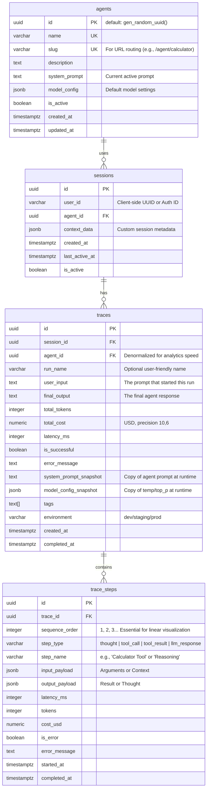

## PostgresSQL  Er Diagram



Here is the **Production-Ready DDL** for PostgreSQL. It includes necessary extensions, indexes for performance, and constraints for data integrity.

You can run this directly in your SQL client (e.g., DBeaver, pgAdmin) or put it into a migration file (e.g., `alembic` or `flyway`).

```sql
-- ====================================================================
-- Quraite Agent Platform - PostgreSQL Schema (Production-Ready Final)
-- Incorporates: Glass-Box Observability, Cost Tracking, and Snapshots
-- ID Strategy: UUID (using gen_random_uuid())
-- Timezone: All timestamps are TIMESTAMPTZ (UTC)
-- ====================================================================

CREATE EXTENSION IF NOT EXISTS "pgcrypto";

-- ====================================================================
-- TABLE: agents
-- Purpose: Agent configurations (System Prompts, Models)
-- ====================================================================
CREATE TABLE agents (
    id UUID PRIMARY KEY DEFAULT gen_random_uuid(),
    name VARCHAR(100) NOT NULL,
    slug VARCHAR(100) NOT NULL, -- URL-friendly identifier (e.g., 'calculator')
    description TEXT,
    system_prompt TEXT NOT NULL,
    model_config JSONB NOT NULL DEFAULT '{}'::jsonb, -- e.g., {"model": "gpt-4", "temp": 0.7}
    is_active BOOLEAN NOT NULL DEFAULT true,
    created_at TIMESTAMPTZ NOT NULL DEFAULT now(),
    updated_at TIMESTAMPTZ NOT NULL DEFAULT now(),

    CONSTRAINT uq_agents_name UNIQUE (name),
    CONSTRAINT uq_agents_slug UNIQUE (slug)
);

CREATE INDEX idx_agents_slug ON agents(slug);

-- ====================================================================
-- TABLE: sessions
-- Purpose: Grouping traces for a user (Anonymous or Authenticated)
-- ====================================================================
CREATE TABLE sessions (
    id UUID PRIMARY KEY DEFAULT gen_random_uuid(),
    user_id VARCHAR(255) NOT NULL, -- Client-side UUID or Auth ID
    agent_id UUID NOT NULL,
    context_data JSONB NOT NULL DEFAULT '{}'::jsonb, -- e.g., {"browser": "chrome"}
    is_active BOOLEAN NOT NULL DEFAULT true,
    created_at TIMESTAMPTZ NOT NULL DEFAULT now(),
    last_active_at TIMESTAMPTZ NOT NULL DEFAULT now(),

    CONSTRAINT fk_sessions_agent
        FOREIGN KEY (agent_id)
        REFERENCES agents(id)
        ON DELETE RESTRICT
);

CREATE INDEX idx_sessions_user_id ON sessions(user_id);
CREATE INDEX idx_sessions_last_active ON sessions(last_active_at DESC);

-- ====================================================================
-- TABLE: traces
-- Purpose: The "Run" - High-level execution record
-- ====================================================================
CREATE TABLE traces (
    id UUID PRIMARY KEY DEFAULT gen_random_uuid(),
    session_id UUID NOT NULL,
    agent_id UUID NOT NULL, -- Denormalized for fast analytics

    -- Inputs/Outputs
    user_input TEXT NOT NULL,
    final_output TEXT, -- Nullable until run completes
    run_name VARCHAR(255),

    -- Metrics
    total_tokens INTEGER DEFAULT 0,
    total_cost NUMERIC(10, 6) DEFAULT 0.000000, -- Precision for micro-dollar costs
    latency_ms INTEGER DEFAULT 0,

    -- Status & Error Handling
    is_successful BOOLEAN DEFAULT true,
    error_message TEXT,

    -- Glass Box Observability Snapshots (Crucial for Replay)
    system_prompt_snapshot TEXT, -- Captured at runtime
    model_config_snapshot JSONB, -- Captured at runtime
    tags TEXT[] DEFAULT ARRAY[]::TEXT[], -- e.g., ["dev", "v2"]
    environment VARCHAR(50) DEFAULT 'production', -- dev/staging/prod

    created_at TIMESTAMPTZ NOT NULL DEFAULT now(),
    completed_at TIMESTAMPTZ,

    CONSTRAINT fk_traces_session
        FOREIGN KEY (session_id)
        REFERENCES sessions(id)
        ON DELETE CASCADE,

    CONSTRAINT fk_traces_agent
        FOREIGN KEY (agent_id)
        REFERENCES agents(id)
        ON DELETE RESTRICT
);

CREATE INDEX idx_traces_session_id ON traces(session_id);
CREATE INDEX idx_traces_agent_id ON traces(agent_id);
CREATE INDEX idx_traces_created_at ON traces(created_at DESC);
CREATE INDEX idx_traces_env ON traces(environment);

-- ====================================================================
-- TABLE: trace_steps
-- Purpose: Atomic observations (Thoughts, Tool Calls, Results)
-- ====================================================================
CREATE TABLE trace_steps (
    id UUID PRIMARY KEY DEFAULT gen_random_uuid(),
    trace_id UUID NOT NULL,

    -- Ordering is critical for the "Waterfall" UI
    sequence_order INTEGER NOT NULL,

    -- Classification
    step_type VARCHAR(50) NOT NULL, -- 'thought', 'tool_call', 'tool_result', 'llm_response'
    step_name VARCHAR(100), -- e.g., 'Calculator', 'Reasoning'

    -- The Glass Box Content (Split for clarity)
    input_payload JSONB, -- Arguments or Context
    output_payload JSONB, -- Result or Thought text

    -- Metrics per step
    latency_ms INTEGER DEFAULT 0,
    tokens INTEGER DEFAULT 0,
    cost_usd NUMERIC(10, 6) DEFAULT 0.000000,

    -- Error tracking
    is_error BOOLEAN DEFAULT false,
    error_message TEXT,

    started_at TIMESTAMPTZ NOT NULL DEFAULT now(),
    completed_at TIMESTAMPTZ,

    CONSTRAINT fk_steps_trace
        FOREIGN KEY (trace_id)
        REFERENCES traces(id)
        ON DELETE CASCADE
);

CREATE INDEX idx_steps_trace_id ON trace_steps(trace_id);
CREATE INDEX idx_steps_order ON trace_steps(trace_id, sequence_order);
CREATE INDEX idx_steps_type ON trace_steps(step_type);

-- ====================================================================
-- SEED DATA: Calculator Agent
-- ====================================================================
INSERT INTO agents (name, slug, description, system_prompt, model_config) VALUES (
    'Calculator Agent',
    'calculator',
    'A helpful assistant that can perform basic arithmetic. It explicitly reasons before acting.',
    'You are a helpful assistant with access to a Calculator tool. You MUST output your response in strict JSON format. Your JSON object must contain: "thought" (reasoning), "action" (tool name or "final_answer"), and "args" (tool arguments).',
    '{"model": "gpt-4-turbo", "temperature": 0.0}'::jsonb
);

```

### 💡 Implementation Tips for the 1-Day Build

1. **JSONB Handling:** Since `input_payload` and `output_payload` are JSONB, you can dump Pydantic models directly into them using `model.model_dump_json()`.
2. **Cost Math:** In Python, use `Decimal` for money calculations before saving to the `NUMERIC` columns to avoid floating-point drift.
3. **Timestamps:** Always ensure your Python backend generates UTC timestamps (`datetime.utcnow()`) when writing to `created_at` or `completed_at`.
4. **Sequence Order:** In your Python loop, keep a simple counter `step_count = 0` and increment it for every Thought, Tool Call, or Result. Pass this to the DB insert. This makes rendering the UI list trivial (`ORDER BY sequence_order ASC`).