Here is the comprehensive **End-to-End User Journey** mapped as a sequence diagram. It covers the entire lifecycle from the user opening the app (Guest Session) to the Agent execution, and finally the Deep-Dive Inspection in the Modal.

```mermaid
sequenceDiagram
    autonumber
    actor User as 👤 Engineer/User
    participant UI as 🖥️ Frontend (React)
    participant API as ⚙️ Backend (FastAPI)
    participant Agent as 🧠 Agent Logic (FSM)
    participant DB as 🗄️ Database (Postgres)

    Note over User, DB: 🟢 PHASE 1: SESSION INITIALIZATION (Guest Mode)

    User->>UI: Opens GlassBoxPlatform
    UI->>UI: Check localStorage for 'quraite_user_id'
    alt New User
        UI->>UI: Generate new UUID (client_id)
        UI->>UI: Save to localStorage
    else Returning User
        UI->>UI: Load existing client_id
    end

    UI->>API: POST /api/v1/sessions {user_id, agent_id='calculator'}
    API->>DB: INSERT INTO sessions (user_id, agent_id, is_active=true)
    DB-->>API: Returning session_id
    API-->>UI: 200 OK {session_id}

    UI-->>User: Display Chat Interface (Ready)

    Note over User, DB: 🔵 PHASE 2: EXECUTION & STREAMING (The "Happy Path")

    User->>UI: Selects "Calculator Agent"
    User->>UI: Types "Calculate 50 * 10, then divide by 2"
    UI->>API: POST /api/v1/chat/stream {message, session_id}

    API->>DB: INSERT INTO traces (status='running', input='...')
    DB-->>API: Returning trace_id
    API->>Agent: Initialize State Machine (trace_id)

    loop Agent Reasoning Loop (ARQ)
        Agent->>Agent: Generate "Thought" (LLM Call)
        Agent->>DB: INSERT trace_steps (type='thought', content=JSON)
        Agent-->>UI: SSE Event: {type: 'thought', trace_id}

        Agent->>Agent: Decide Next Action: Tool Call
        Agent->>DB: INSERT trace_steps (type='tool_call', name='multiply', args={a:50, b:10})
        Agent-->>UI: SSE Event: {type: 'tool_call', name: 'multiply'}

        Agent->>Agent: Execute Python Function (50 * 10)
        Agent->>DB: INSERT trace_steps (type='tool_result', output='500', latency=10ms)
        Agent-->>UI: SSE Event: {type: 'tool_result', output: '500'}

        Note right of Agent: Loop continues for 2nd step (Divide by 2)
    end

    Agent->>Agent: Generate Final Answer
    Agent->>DB: INSERT trace_steps (type='llm_response', content='The answer is 250')
    Agent->>DB: UPDATE traces SET status='completed', cost=$$$, latency=2s
    Agent-->>UI: SSE Event: {type: 'final', content: 'The answer is 250'}
    API-->>UI: Close Stream

    UI-->>User: Render Final Chat Bubble

    Note over User, DB: 🟠 PHASE 3: OBSERVABILITY SWITCH

    User->>UI: Clicks "Traces" in Sidebar
    UI->>API: GET /api/v1/traces?session_id={current}
    API->>DB: SELECT * FROM traces ORDER BY created_at DESC
    DB-->>API: Return [Trace A, Trace B...]
    API-->>UI: Return JSON List
    UI-->>User: Render Data Table (Status, Cost, Latency)

    Note over User, DB: 🔴 PHASE 4: DEEP INSPECTION (The "Glass Box")

    User->>UI: Clicks Row for "Calculate 50 * 10..."
    UI->>UI: Open Modal (90% Screen Overlay)
    UI->>API: GET /api/v1/traces/{trace_id} (Include Steps)
    API->>DB: SELECT * FROM traces WHERE id = ...
    API->>DB: SELECT * FROM trace_steps WHERE trace_id = ... ORDER BY sequence_order
    DB-->>API: Return Trace + Steps Tree
    API-->>UI: Return Detailed Trace JSON

    UI->>UI: Render "Waterfall" Timeline

    User->>UI: Clicks "Expand" on Tool Step #2
    UI-->>User: Show JSON Input: {"a": 500, "b": 2}
    UI-->>User: Show JSON Output: {"result": 250}
    UI-->>User: Show Latency Badge (12ms) & Cost ($0.0001)

    opt Replay/Eval
        User->>UI: Clicks "Replay Run"
        UI->>API: POST /api/v1/replay/{trace_id}
        Note right of UI: Cycle returns to Phase 2
    end

```

